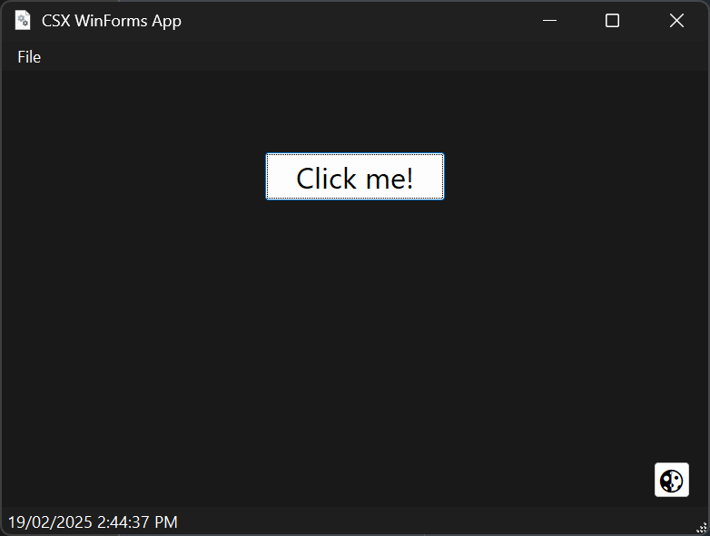

# CSX-Forms

CSX-Forms is a WinForms utility script for CSX files to build windowed applications using C# scripting. It provides a set of utilities to create and manage Windows Forms with modern features like dark mode, rounded corners, and custom themes.

## Features

- **DPI Scaling**: Automatically scales forms based on the system DPI.
- **Dark Mode**: Automatically detects and applies dark mode based on the Windows theme.
- **Rounded Corners**: Enables rounded corners for Windows 10 and above.
- **Custom Themes**: Easily switch between light and dark themes with customizable colors.
- **Keyboard Shortcuts**: Add keyboard event handlers to forms.
- **WinForms Controls**: Use standard WinForms controls like buttons, labels, and textboxes.

## Getting Started

### Prerequisites

- .NET Framework
- [CSX](https://github.com/dotnet-script/dotnet-script) (C# scripting)

### Installation

1. Clone the repository:
    ```sh
    git clone https://github.com/AlexMollard/CSX-Forms.git
    cd CSX-Forms
    ```

2. Ensure you have the required dependencies:
    ```sh
    dotnet tool install -g dotnet-script
    ```

### Usage

1. Create a new CSX script or use one of the examples provided in the `examples` directory.

2. Load the `Window.csx` script in your CSX file:
    ```csharp
    #load "Window.csx"
    ```

3. Use the `WindowManager` class to create and manage your forms. For example:
    ```csharp
    using System;
    using System.Windows.Forms;
    using System.Drawing;

    WindowManager windowManager = new WindowManager();

    Form form = new Form
    {
        Text = "My App",
        Size = new Size(800, 600),
        Font = new Font("Segoe UI", 16F),
        Icon = Icon.ExtractAssociatedIcon(Application.ExecutablePath) // Set the window icon (optional)
    };

    windowManager.CreateForm(form); // All done here!
    ```

### Examples

- **Calculator Window**: A simple calculator application.
    ```sh
    dotnet script examples/calculatorWindow.csx
    ```

- **Basic Window**: A basic window with a button and status strip.
    ```sh
    dotnet script examples/basicWindow.csx
    ```

### Screenshots


